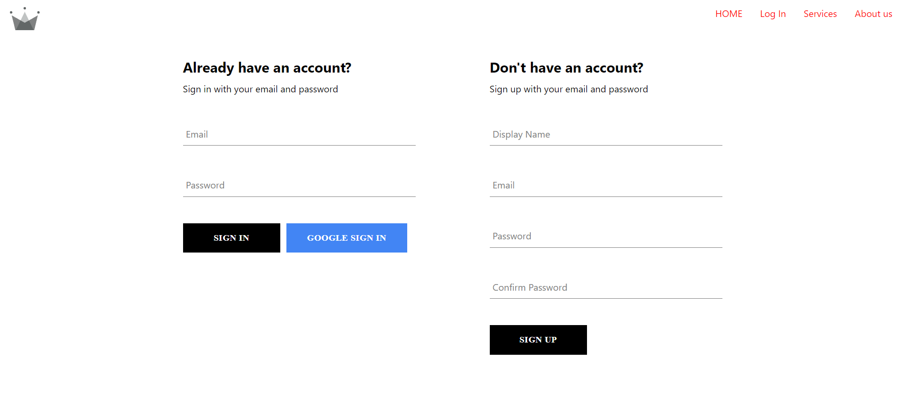
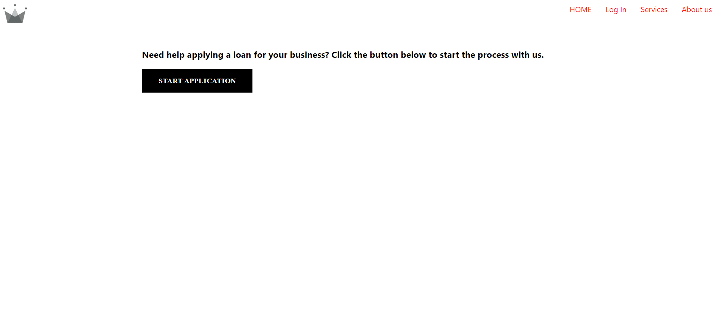
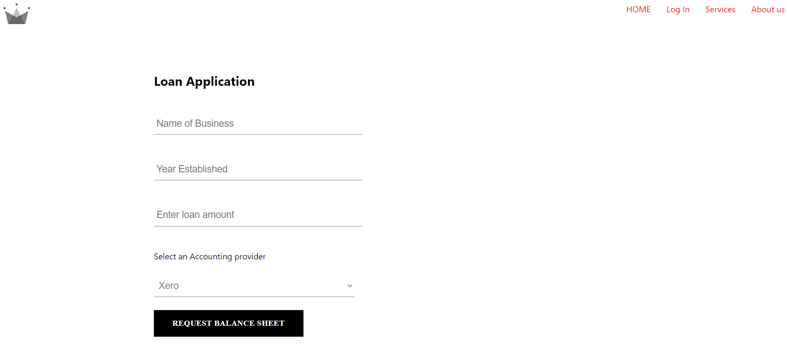
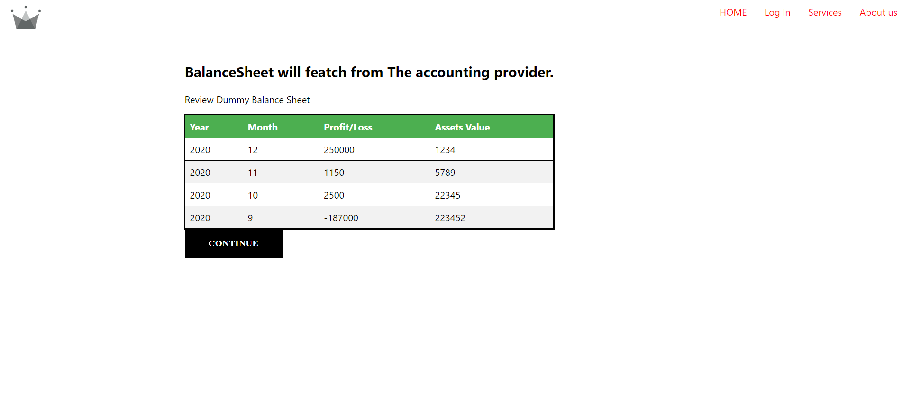
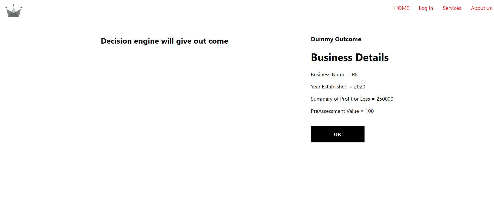

## About Project

Hello,
I created Business Loan application system. I used React as the frontend framework and javascript and Firebase for the backend.

# Features:

- User SignIn/SignUp/LogIn
- User will Fill Business Details & Loan amount, Select Accounting provider and Request Balance Sheet
- Backend will give Return Details for Review and Application Result
- There are requestDecision, applyRule and useFetchDecision there are responsible for made call for Accounting Software and Decision Engine
- applyRule - Contains Rules to be applied before sending to Decision Engine
- requestDecision - Contains code for calling Decision Engine
- useFetchDecision - Contains code for fetch API for handling data from server.
- Tool: React, React-Router, Custom Hook, Firebase, SCSS, and hooks

## Images







## Requirement

The goal of the project is to build a simple business loan application system.

The system consists of the following:

- Frontend
- Backend

The backend would integrate with third-party providers such as:

- Decision engine - This is where the final application will be
  submitted to present the outcome of the application.
- Accounting software providers will provide a balance sheet for a selected business of the user.

Below is a sequence diagram to help visually understand the flow.

```mermaid

sequenceDiagram
  Actor User as User
  participant FE as Frontend
  participant BE as Backend
  participant ASP as Accounting Software
  participant DE as Decision Engine

  User ->> FE: Start Application

  FE ->> BE: Initiate Application
  BE ->> FE: Initiate Complete

  User ->> FE: Fill Business Details & Loan amount
  User ->> FE: Select Accounting provider
  User ->> FE: Request Balance Sheet
  FE ->> BE: Fetch Balance Sheet
  BE ->> ASP: Request Balance Sheet
  ASP ->> BE: Return Balance Sheet
  BE ->> FE: Return Details for Review

  User --> FE: Review Complete
  User ->> FE: Submit Application

  FE ->> BE: Request outcome
  BE ->> BE: Apply Rules to summarise application
  BE ->> DE: Request Decision
  DE ->> BE: Returns outcome

  BE ->> FE: Application Result
  FE ->> User: Final Outcome

```

Assumptions:

- You may choose from the following language: Javascript, Typescript, Python, Golang / HTML, CSS.
- For frontend, you could use a framework such as React / Vue, though basic HTML is also acceptable.
- The accounting software and decision engine are already implemented. The backend should provide a simulation of the above.
- The frontend can be very basic.
- The accounting provider option on frontend would include Xero, MYOB and more in future.
- A sample balance sheet received from Accounting provider:

```json

sheet = [
    {
        "year": 2020,
        "month": 12,
        "profitOrLoss": 250000,
        "assetsValue": 1234
    },
    {
        "year": 2020,
        "month": 11,
        "profitOrLoss": 1150,
        "assetsValue": 5789
    },
    {
        "year": 2020,
        "month": 10,
        "profitOrLoss": 2500,
        "assetsValue": 22345
    },
    {
        "year": 2020,
        "month": 9,
        "profitOrLoss": -187000,
        "assetsValue": 223452
    }
]
```

## Rules to be applied before sending to Decision Engine

- If a business has made a profit in the last 12 months. The final value to be sent with a field `"preAssessment": "60"` which means the Loan is favored to be approved 60% of the requested value.
  If the average asset value across 12 months is greater than the loan amount then `"preAssessment": "100"`
- Default value to be used `20`

## The Final output to be sent to the decision engine would contain minimum details such as

- Business Details such as:
  - Name
  - Year established
  - Summary of Profit or loss by the year
- preAssessment value as per the rules

## Judging Criteria

- Engineering principles & standards
- System extensibility & Scalability
- Testability
- Brevity and Simplicity
